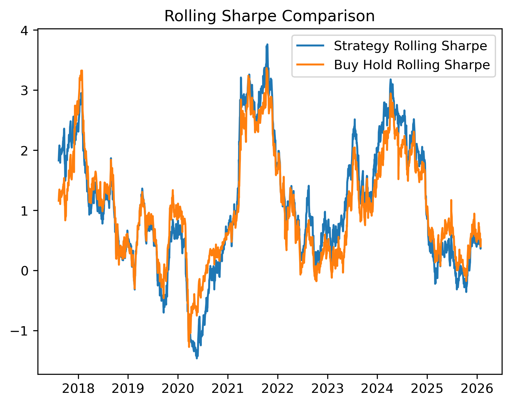
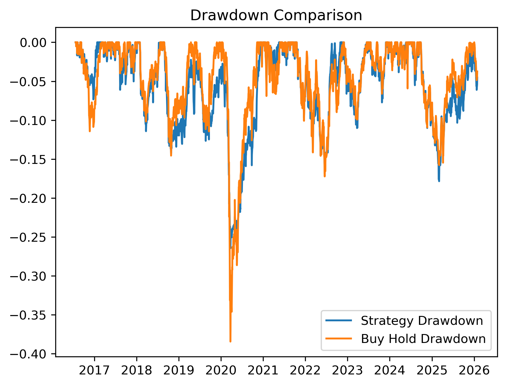

# Macro Liquidity Regime Allocation Strategy

## Strategy Performance Summary

| Metric | Strategy | Buy & Hold |
|---|---|---|
| CAGR | ~13% | ~12–13% |
| Sharpe Ratio | >1.0 | ~0.8 |
| Max Drawdown | ~-22% | ~-38% |

Key Result:

- Comparable long-term returns.
- Meaningfully lower drawdowns.
- Improved risk-adjusted performance.

## Overview

This project develops a systematic macro trading framework studying how global liquidity conditions influence equity market performance and portfolio risk.

Starting from an economic hypothesis that global liquidity drives risk assets, the research evolves through statistical modelling, liquidity regime classification, and portfolio construction to build a risk-managed allocation strategy for the NIFTY index.

The final framework combines:

- Macro factor modelling
- Liquidity regime classification
- Dynamic portfolio allocation
- Volatility targeting risk management

The objective is not only return generation but improved risk-adjusted performance and capital preservation.

---

## Motivation

Global liquidity cycles influence emerging market equities through capital flows, currency strength, interest rate expectations, and financial conditions.

This project explores the question:

> Can systematic allocation based on macro liquidity regimes improve equity risk management compared to passive investing?

---

## Methodology

### Version 1 — Research Hypothesis

Initial research explored relationships between macro variables and forward NIFTY returns:

- US Treasury yields (US10Y)
- US Dollar Index (DXY)
- Oil prices
- USDINR exchange rate

The goal was to understand macro sensitivity rather than build a trading rule immediately.

---

### Version 2 — Regression Model

An Ordinary Least Squares (OLS) regression model estimates forward 20-day NIFTY returns using macro variables.

Outputs included:

- Liquidity proxy signal
- Statistical diagnostics
- Predictive limitations of direct macro forecasting

This stage highlighted the instability of pure prediction models.

---

### Version 3 — Liquidity Regime Framework

Instead of predicting returns directly, markets are classified into liquidity environments using:

- Liquidity Z-Score normalisation
- Trend smoothing
- Momentum measures

Identified regimes:

- Expansion
- Recovery
- Late Cycle
- Contraction

Each regime maps to dynamic portfolio exposure levels.

---

### Portfolio Construction

Allocation adjusts based on macro regime strength:

- Expansion → Higher equity exposure
- Recovery → Supportive risk allocation
- Late Cycle → Moderated positioning
- Contraction → Defensive exposure

Signals are shifted forward to avoid look-ahead bias.

---

### Volatility Targeting Overlay

A realised volatility overlay dynamically adjusts exposure during market stress.

This combines:

- Slow macro signal (liquidity conditions)
- Fast market signal (realised volatility)

The objective is improved drawdown control while maintaining return participation.

---

## Results

Backtest comparison:

| Strategy | CAGR | Sharpe | Max Drawdown |
|---|---|---|---|
| Buy & Hold | ~12–13% | ~0.81 | ~-38% |
| Liquidity + Vol Target | ~13% | >1.0 | ~-22% |

Key Observations:

- Comparable or improved CAGR relative to passive investing.
- Meaningful reduction in drawdowns during stress periods.
- Improved risk-adjusted performance.

---

## Visual Results

### Equity Curve

---

### Rolling Sharpe Comparison

---

### Drawdown Comparison

---

## Project Structure

macro_liquidity_regime_strategy/

src/
macro_model_v1.py
macro_model_v2.py
macro_model_v3_vol_target.py

data/
macro_data.csv

results/
charts/
equity_curve.png
rolling_sharpe.png
drawdown.png

---

## Tools and Libraries

- Python
- pandas
- yfinance
- statsmodels
- matplotlib

---

## Key Learnings

- Direct macro prediction is statistically unstable.
- Regime classification improves robustness.
- Risk overlays materially enhance portfolio outcomes.

---

## Future Improvements

- Multi-asset allocation extension.
- Hidden Markov regime modelling.
- Transaction cost modelling.
- Out-of-sample validation.

---

## Disclaimer

This project is for research and educational purposes only and does not constitute investment advice.

